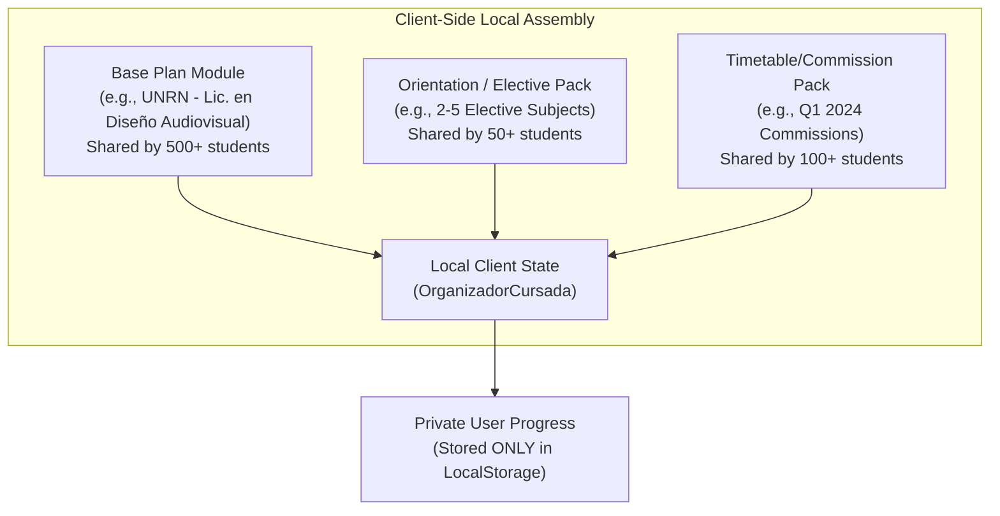
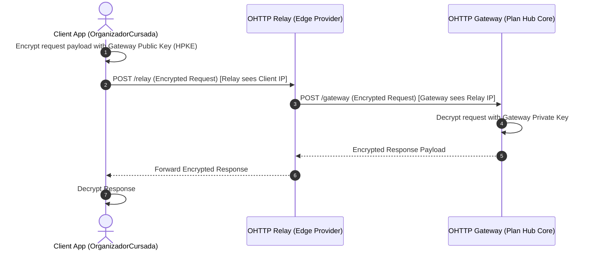
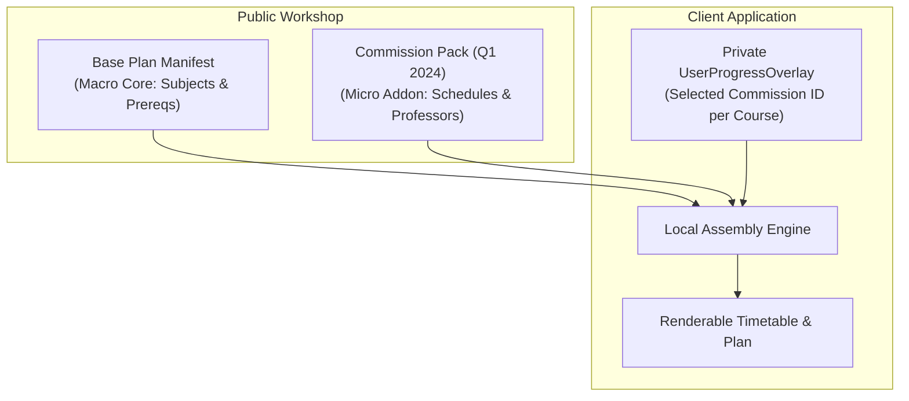

# System Architecture & Design Document: Privacy-Preserving Career Workshop ("Plan Hub")

> **Status:** Finalized Architectural Design & Specification  
> **Goal:** Design a decentralized/privacy-centric community workshop (inspired by Steam Workshop) for sharing, subscribing to, and updating university study plans (*carreras*), courses, prerequisites, and schedules without compromising user anonymity or causing deanonymization.

---

## 1. Problem Statement & Core Vision

University study plans (careers, subject prerequisite networks, commission schedules, professor lists) are often locked behind legacy university portals, PDFs, or scattered informal student networks.

A **Steam Workshop-like community hub** enables students to:
- Browse, download, and subscribe to verified or custom study plans (*carreras*).
- Fork and customize study plans (e.g., custom electives, specific campus branches, modified prerequisite rules).
- Receive updates when the original author or community updates course codes, prerequisites, or schedules.

### The Critical Catch: Privacy & Deanonymization Vulnerability
Unlike video game mods or game levels, university study plans contain highly identifying real-world signal:
1. **Curriculum/Niche Specificity:** A specific combination of rare electives, university name, branch campus, and start year can pinpoint a tiny cohort of students (or even a single individual).
2. **Author & Subscriber Fingerprinting:** Uploading or subscribing to a specific study plan reveals your university, degree, year of study, and potentially your geographical location/IP address.
3. **Progress Leakage:** If updates or telemetry interact with a central server, student completion status (`pending`, `coursing`, `coursed`, `approved`) could be linked to real identity.

---

## 2. Key Challenges & Architectural Questions

### 2.1 The "Niche Fingerprint" Intersection Vulnerability
- **The Problem:** If a user uploads or subscribes to a highly specific study plan (e.g., *"Licenciatura en Diseño Audiovisual - Orientación Guión - Cohorte 2024 - Sede Bariloche"*), there might only be 5-10 people in the world matching that exact description. Even if the uploader is completely anonymous (no account, pseudonymized hash), their identity can be inferred by cohort size and timing.
- **Context & Argentine Reality:** In the majority of Argentine university programs (*carreras*), curricula are largely fixed and standardized across cohorts. Typically, only **2 to 5 courses** are electives (*optativas/electivas*). Furthermore, students sometimes need to attend a different campus branch (*sede*) or even another faculty/university location to take specific electives. As a result, the primary fingerprint risk comes from cross-campus elective combinations or specific schedule/commission selections rather than massive degree branching.
- **❓ Core Question:** How does your system prevent deanonymization through **rare subject combinations / cohort intersection attacks**? Should the system restrict or generalize metadata before publishing?

### 2.2 Network & Telemetry Leaks (IP & Request Timing)
- **The Problem:** Whenever a client queries a server for updates to "Career ID #8492" (e.g. periodically checking for new course schedules), the server receives the client's IP address, time of day, and client fingerprint. Over time, correlating IP locations with class timetables makes deanonymization trivial.
- **❓ Core Question:** How will update checks happen without revealing who is fetching which career? Are we using static CDN fetching (blind broadcast), P2P/WebTorrent distribution, Tor/Oblivious HTTP relays, or local differential privacy?

### 2.3 Separation of Public Assets vs. Private Student Progress
- **The Problem:** In Steam Workshop, mod assets are static files. In an academic organizer, a career is tightly integrated with a user's personal lifecycle status (`pending`, `coursing`, `coursed`, `approved`) and custom semester layouts.
- **❓ Core Question:** How do you strictly separate the **public immutable plan template** (shared via Workshop) from the **user's sensitive private progress** so that user state NEVER touches the network?

### 2.4 The "Mod Update" Merge Conflict Problem
- **The Problem:** Suppose Student A downloads an Architecture plan, modifies 3 prerequisites, moves 2 subjects to different semesters, and marks 10 subjects as `approved`. A month later, the original plan author uploads an **Update v2** (e.g. fixing a subject name and adding a new 4th-year elective).
- **❓ Core Question:** How does your system merge Upstream Plan Updates into a user's customized local state without overwriting their completed subjects, breaking custom prerequisite rules, or causing state corruption?

### 2.5 Data Granularity Trade-off (Macro vs. Micro)
- **The Problem:** 
  - *Macro Data:* University name, degree name, subjects, years, semesters, prerequisite chains (`cursarReq`, `aprobarReq`).
  - *Micro Data:* Professor names, commission schedule slots (`Lesson[]`), classroom numbers, Telegram group links.
- **❓ Core Question:** What *exactly* belongs inside a Workshop asset? Micro data makes the Workshop vastly more useful to students, but micro data also dramatically increases privacy risks (identifying specific classes attended) and data decay. Where do you draw the line?

### 2.6 Decentralized Trust & Vandalism Prevention
- **The Problem:** Steam Workshop relies on Steam accounts, moderation, and community reports to remove malware or broken mods. If users in your system are anonymous to protect their identity, what stops a malicious actor from uploading fake careers, subtle sabotage (swapping prerequisite requirements right before enrollment season), or spamming thousands of junk plans?
- **❓ Core Question:** How do you implement trust, voting/ratings, and anti-vandalism moderation **without requiring user accounts that track people**?

### 2.7 Forking vs. Canonical Authorities
- **The Problem:** If 15 students from the same university make small corrections to the official Engineering plan, you end up with 15 slightly different versions.
- **❓ Core Question:** Should the Workshop function as a **flat web of forks** (like public GitHub repos), or should it have a **crowdsourced consensus / community wiki model** where multiple contributors merge changes into one canonical plan per career? How do you prevent fragmenting the community?

---

## 3. Agreed Architectural Decisions

### 3.1 Mitigation Strategy for 2.1 (Niche Fingerprint & Cohort Intersection Defense)

To eliminate cohort intersection vulnerabilities and prevent deanonymization via rare subject combinations, the system adopts a 5-pillar technical defense model:

#### Pillar 1: Modular "Lego Brick" Architecture (Primary Defense)
Instead of allowing users to upload monolithic, end-to-end personal study plans (*"Lic. en Diseño Audiovisual - Guión 2024 - Sede Bariloche"*), the system enforces a **decoupled modular model**. A complete student schedule is composed client-side from 3 independent public layers:



* **Base Degree Module:** Contains only the canonical mandatory curriculum (`cursarReq`, `aprobarReq`) shared by all students in a degree.
* **Standalone Elective Packs:** Packs of 2 to 5 elective subjects (*optativas/electivas*). If an elective is taken at another campus/location (*sede*) or university, it is published as an isolated location pack.
* **Commission / Timetable Packs:** Crowdsourced schedule slots (`Lesson[]`) published independently per subject, decoupled from what *other* subjects a student takes.

> [!TIP]
> **Why this solves the vulnerability:** When a user uploads a new elective or schedule slot, they only publish the **atomic module** (e.g., *"Schedule Pack for Chemistry I - Q1 2024"*). This atomic block carries zero signal about what *other* subjects they are enrolled in or what cohort year they belong to.

#### Pillar 2: Hierarchical Metadata Generalization ($k$-Anonymity Enforcer)
Before a plan can be published to the public hub, the protocol enforces $k$-anonymity constraints on metadata attributes:
1. **Stripping High-Cardinality Fields:** Fields like `cohort_year` (e.g., 2024), `campus_building`, or `commission_number` are strictly prohibited in published Base Plan manifests.
2. **Metadata Generalization:**
   * *Raw (Private):* `"Sede San Martín - Aula 4B - Turno Noche"` $\rightarrow$ *Generalized (Public):* `"Turno Noche"`.
   * *Raw (Private):* `"Plan 2024 - Res. Min. 412/24"` $\rightarrow$ *Generalized (Public):* `"Plan 2024"`.
3. **Minimum Bucket Size Requirement ($k \ge 20$):** If a custom orientation or rare elective pack has fewer than $k$ active subscribers in the hub, it cannot be indexed in public search results. It can only be shared via direct link or compiled into the base degree plan.

#### Pillar 3: Client-Side Pre-Flight Sanitizer & Entropy Scorer
The client application runs an automated privacy audit before generating a shareable export or publishing to the hub:

```
[ User Clicks "Publish Plan" ]
       │
       ▼
┌────────────────────────────────────────────────────────┐
│ Client-Side Sanitizer Engine                           │
│ 1. Strips user status ('approved', 'coursing', etc.)   │
│ 2. Strips custom notes, timestamps, local IDs          │
│ 3. Calculates Plan Entropy Score (Uniqueness Index)    │
└────────────────────────────────────────────────────────┘
       │
       ├─── Entropy > Threshold (Too Unique / High Risk) ──► Show Warning & Prompt Modular Split
       └─── Entropy <= Threshold (Safe to Publish)      ──► Proceed to Publishing
```

> [!IMPORTANT]
> **Entropy Scoring Logic:** The client calculates how unique the subject graph is compared to standard degree templates. If a user combines 4 rare electives across different campuses/sedes, the score flags: *"This subject combination is highly unique (< 5 users). Publishing this exact combination may reveal your identity."* The user is prompted to publish the electives as separate standalone packs instead.

#### Pillar 4: Blind Broadcast / Bucket-Based Update Distribution
Querying updates for hyper-specific plan IDs directly reveals subscriber IP addresses and timetable correlation to network observers.
* **Coarse Topic Subscription:** Clients do NOT check for updates on hyper-specific plan hashes. Instead, clients subscribe to **macro topic buckets** (e.g., `UNRN_AUDIOVISUAL_ALL`).
* The update manifest returned for `UNRN_AUDIOVISUAL_ALL` contains static diffs for *all* sub-modules of that degree. The client filters relevant updates locally, hiding individual subscriber choices within large client fetch pools.

#### Pillar 5: Coarse-Grained Metrics & Differential Privacy
To prevent deanonymization via real-time subscriber counts (e.g., an attacker monitoring a plan's subscriber count increase from 1 to 2):
* **Subscriber Count Bucketing:** Display counts in broad ranges (`< 10`, `10-50`, `50-100`, `100+`).
* **Noise Injection (Laplacian Noise):** Public analytics endpoints add small random noise to real-time interaction metrics.
* **Batch Publishing Delays:** Newly published packs are indexed in delayed batch intervals (e.g., every 6 hours) rather than instantaneously, preventing timing correlation between class enrollment and uploads.

---

### 3.2 Mitigation Strategy for 2.2 (Network & Telemetry Leak Prevention)

To prevent deanonymization via IP tracking, request timing correlation, and network fingerprinting during plan/schedule update checks, the system implements a **4-Layer Privacy-Preserving Network Architecture**:

#### Layer 1: Static CDN Blind Broadcast & Hierarchical Bucket Fetching (Primary IP Defense)
Instead of clients querying a dynamic server for specific plan IDs (`GET /api/v1/plans/8492/updates`), update distribution is 100% static and bucketed at the edge:
1. **Coarse University/Faculty Bundles:** Updates are compiled into immutable static JSON manifests hosted on globally distributed CDNs (Cloudflare R2, Fastly, or GitHub Pages), e.g., `/updates/bundles/unsam_exactas.json.gz`.
2. **K-Anonymous Fetch Crowd:** Every student from `UNSAM Exactas` fetches the exact same static bundle file regardless of their specific degree or elective choices. 
3. **Local In-Memory Extraction:** The client app downloads the faculty bundle and extracts updates for "Career ID #8492" locally. To the CDN server and network observers, all requests look identical, blending the user into a massive k-anonymous subscriber crowd.

#### Layer 2: Hash-Prefix k-Anonymity Fetching (Fallback for Modular Elective Packs)
For standalone elective packs or lower-traffic modules that cannot fit into major faculty bundles:
* **Prefix-Based Queries (HaveIBeenPwned Model):** The client hashes the target Module ID `SHA256("module_8492")` $\rightarrow$ `e3b0c44298...`.
* The client sends only the 4-character hex prefix: `GET /updates/prefix/e3b0.json`.
* The CDN returns a static bucket containing updates for **all** modules starting with `e3b0` (typically 100–250 modules).
* The client filters the target module locally. The server cannot discern which of the 250 modules in the response the user actually owns.

#### Layer 3: Oblivious HTTP (OHTTP / RFC 9458) for Dynamic Operations
For sparse dynamic actions that cannot be pre-rendered into static CDN files (e.g., submitting anonymous community timetable reports or ratings):
* **Dual-Relay Encryption:** Implements Oblivious HTTP (OHTTP - RFC 9458).
* **Relay Server (e.g., Fastly / Cloudflare):** Sees the client's IP address but cannot decrypt the HPKE-encrypted request payload or see the target URI.
* **Gateway Server (Application Core):** Decrypts the request payload using its private key and executes the operation, but only sees the Relay's IP address.
* **Result:** Cryptographic decoupling of identity (IP) from action (request body).



#### Layer 4: Randomized Timing Jitter & Telemetry Normalization (Timing Defense)
To prevent network timing correlation (e.g., an observer correlating update check timestamps with known university class schedules):
1. **Exponential Uniform Jitter:** Update checks never run at fixed time intervals (e.g., top of the hour or on app launch). Checks are scheduled using randomized uniform intervals with a $\pm 12$-hour Gaussian jitter window:
   $$t_{\text{next}} = t_{\text{base}} + \text{Uniform}(-12\text{h}, +12\text{h})$$
2. **Background Idle Sync:** Sync operations run during system idle windows or overnight charging states.
3. **Strict Telemetry Stripping:** HTTP requests use uniform `User-Agent` strings and contain zero custom headers (`X-Client-Version`, `X-User-ID`, `X-Plan-Hash`). All requests are indistinguishable static HTTP GETs.

> [!NOTE]
> **Why P2P/WebTorrent was Rejected:** While P2P/WebTorrent distribution seems privacy-preserving at first glance, P2P swarm protocols directly expose peer IP addresses to all other swarm participants. Without Tor routing, P2P actually *increases* IP deanonymization risk for niche university plans. CDN Blind Broadcast + OHTTP provides far stronger network privacy with zero peer exposure.

---

### 3.3 Mitigation Strategy for 2.3 (Separation of Public Plan Templates vs. Private User Progress)

To ensure that personal student progress (`pending`, `coursing`, `coursed`, `approved`), grades, custom notes, and semester drag-and-drop layouts **NEVER** touch the network, the system enforces a **5-Pillar Air-Gapped Overlay Architecture**:

#### Pillar 1: Dual-Schema Separation (Immutable Base vs. Volatile Delta)
The domain model is strictly partitioned into two decoupled schemas:
1. **Public Plan Template (`PlanManifest`) – Public Asset:**
   * **Immutable & Content-Addressed:** Hashed via canonical SHA-256 JSON digest.
   * **Contains ONLY static curriculum structures:** Course metadata (`id`, `name`, `year`, `q`), prerequisite requirement graphs (`cursarReq`, `aprobarReq`), default semester grid layouts, and schedule templates (`Lesson[]`).
   * **Strict Schema Rules:** A JSON Schema validator rejects any payload containing user lifecycle states (`status`, `grade`, `user_notes`, `moved_semester`).
2. **Private User Progress (`UserProgressOverlay`) – Private Local State:**
   * **Volatile & Local-Only:** Stored exclusively in local browser storage (`localStorage` / `IndexedDB`).
   * **Contains ONLY ID-keyed delta maps:**
     ```typescript
     interface UserProgressOverlay {
       planId: string;
       courseStatuses: Record<string, 'pending' | 'coursing' | 'coursed' | 'approved'>;
       semesterOverrides: Record<string, number>; // Moved semester slot index
       selectedLessons: Record<string, string[]>; // Selected commission IDs
       userNotes: Record<string, string>;         // Private personal notes & grades
     }
     ```

#### Pillar 2: Pure Functional Projection Engine ($f(\text{Base}, \text{Delta}) = \text{ViewState}$)
Instead of mutating the underlying `PlanManifest` when a student modifies course statuses or moves a lesson, the client application runs a pure functional projection:

$$\text{RenderableCourseList} = f(\text{ImmutablePlanManifest}, \text{UserProgressOverlay})$$

```mermaid
flowchart TD
    subgraph Storage Layer
        A["Immutable PlanManifest<br/>(Fetched from static CDN / Hub)"]
        B["Private UserProgressOverlay<br/>(Stored ONLY in LocalStorage)"]
    end

    subgraph Client-Side Memory (Angular Signals Store)
        A --> Projection["Pure Projection Engine<br/>f(Manifest, Overlay)"]
        B --> Projection
        Projection --> ViewState["Renderable UI State<br/>(Readonly Course[] Signals)"]
    end

    subgraph Network Boundary
        A .->|Static Unauthenticated Download| Network["CDN / Network"]
        B x--x|STRICT AIR-GAP: Never Sent| Network
    end
```

* **Immutability in Memory:** `Object.freeze()` is applied to all loaded `PlanManifest` objects in JavaScript/TypeScript memory.
* **UI State Updates:** Toggling a subject status in the UI triggers an update **only** to the `UserProgressOverlay` Angular Signal store.
* **Seamless Upstream Plan Updates:** When an author uploads an updated plan version (e.g. adding a new elective), the base `PlanManifest` is swapped out locally without wiping or corrupting the user's `UserProgressOverlay`.

#### Pillar 3: Structural Air-Gap & Zero-Knowledge Serialization Pipeline
To prevent accidental state leaks during export or Workshop sharing:
1. **Pipeline A: Personal Local Backup (`.orgcursada-userstate`)**
   * Exports the `UserProgressOverlay` JSON for manual device migration.
   * Embeds a mandatory header marker and visual warning: *"Private Personal Progress — DO NOT upload to public spaces."*
   * Workshop upload endpoints explicitly reject files with this format marker.
2. **Pipeline B: Public Workshop Publishing (`.orgcursada-plan`)**
   * Passes through a **Type-Safe Whitelist Serializer (`pickPlanManifestFields`)**.
   * Strips 100% of progress signals, custom notes, local timestamps, and execution logs.
   * Generates a fresh content-based SHA-256 hash for the public asset manifest.

#### Pillar 4: Cryptographic Salted Pseudo-IDs for State Keying
To prevent cross-device or network tracking of user progress through deterministic course or plan IDs:
* **Local Salted State Keying:** Subject keys inside `UserProgressOverlay` are stored using a local per-device salt:
  $$\text{LocalCourseKey} = \text{HMAC\_SHA256}(\text{PlanID} + \text{LocalDeviceSalt}, \text{CourseName})$$
* **Privacy Guarantee:** Even if an attacker obtains a copy of `localStorage`, the progress keys cannot be correlated with public Workshop plan IDs or other users' local storage files without knowing the randomly generated `LocalDeviceSalt` (which remains exclusively on the client).

#### Pillar 5: Static Build & Architectural Boundary Enforcer
To guarantee that network modules can never read or transmit student progress:
1. **Stateless Network Requests:** All HTTP requests made to CDNs or update distribution relays use bare, unauthenticated GET requests without JWTs, user session cookies, or telemetry headers.
2. **ESLint Module Boundary Rule:** An automated lint check enforces module import restrictions:
   ```typescript
   // ESLint restriction: Network handlers cannot import state stores
   "no-restricted-imports": ["error", {
     "paths": [{
       "name": "../services/course.service",
       "message": "Network handlers MUST NEVER import UserProgressStore or course state."
     }]
   }]
   ```
3. **CI Pipeline Invariant Test:** Automated unit tests verify that any payload sent over the wire during update checks or search queries contains **zero bytes** matching private overlay schemas.

---

### 3.4 Mitigation Strategy for 2.4 (Steam Workshop Plan Updates & Non-Destructive Local Rebase Architecture)

To handle upstream plan updates without overwriting completed subjects, corrupting state, or confusing students with Git-style merge conflicts, the system addresses the reality that **university degrees are official, bureaucratically approved documents**—not arbitrary branching code repositories. 

In this model, degree updates consist of two real-world phenomena:
1. **Base Plan Manifest Updates:** Community maintainers digitizing new degrees or issuing corrections (e.g., fixing subject name typos, adding newly introduced electives, or updating official ministerial resolutions).
2. **Community Schedule/Commission Packs:** Dynamic seasonal updates containing commission times (`Lesson[]`), professors, and semester timetables.

The system replaces Git-like branching with a **Steam Workshop Modular Overlay & Non-Destructive Local Rebase Architecture**:

```mermaid
flowchart TD
    subgraph Upstream Workshop (Public / Immutable)
        V1["Base Plan Manifest v1.0"] -->|Author Updates| V2["Base Plan Manifest v1.1<br/>(Typo fixes, 1 new elective)"]
        Pack["Commission / Schedule Pack<br/>(Q1 2024 Timetables)"]
    end

    subgraph Client-Side Rebase Engine
        V2 --> Rebase["Non-Destructive Delta Rebase Engine<br/>f(Manifest_v2, Pack, Overlay)"]
        Pack --> Rebase
        Overlay["Private UserProgressOverlay<br/>• Completed Statuses (10 approved)<br/>• Local Semester Overrides (2 moved)<br/>• Custom Prereq Overrides (3 modified)"] --> Rebase
    end

    subgraph Resulting UI State
        Rebase --> Final["Updated UI ViewState<br/>• 10 Approved subjects UNTOUCHED<br/>• Typo fixed visually<br/>• New elective added as 'pending'<br/>• Local overrides preserved & validated"]
    end
```

#### Pillar 1: Stable Canonical Entity Identifiers (ID vs. Attribute Decoupling)
* **UUID / URN Keying:** Courses inside a `PlanManifest` are identified by immutable canonical IDs (e.g., `urn:orgcursada:unrn:audiovisual:pa1` or UUID v4), rather than mutable display names or fragile array indices.
* **Typo & Name Patching:** If upstream v2 corrects `"Matematica 1"` to `"Matemática I"`, the underlying `course_id` remains unchanged.
* **Zero-Touch Progress Guarantee:** Since `UserProgressOverlay.courseStatuses` keys progress by `course_id` (`mat101 => 'approved'`), updating display strings or descriptions upstream updates the UI label instantaneously with zero impact on completion status.

#### Pillar 2: Three-Tier Priority Cascade (Steam Workshop Model)
The system evaluates state using a strict 3-tier priority cascade:
1. **Tier 1: Canonical Base Plan Manifest (Base Game):** Official degree curriculum (`cursarReq`, `aprobarReq`, official year/semester). Published by plan maintainers.
2. **Tier 2: Subscribed Addon Modules (Workshop Mods):** Timetable packs, professor lists, and elective packs.
3. **Tier 3: User Progress & Preference Overlay (User Config):** Local user state containing:
   * **Progress State Map:** `{ [courseId]: 'approved' | 'coursed' | 'coursing' | 'pending' }`
   * **Semester Placement Overrides:** `{ [courseId]: targetSemesterIndex }`
   * **Custom Prerequisite Overrides:** `{ [courseId]: { addPrereqs: string[], removePrereqs: string[] } }`

#### Pillar 3: Non-Destructive Delta Rebase Algorithm
When a client detects an upstream update from `PlanManifest_v1` to `PlanManifest_v2`, the client executes an automated 4-step rebase:

1. **Step 1: Manifest Swap:** Replace cached `PlanManifest_v1` with `PlanManifest_v2`.
2. **Step 2: Progress Preservation:** Retain the `UserProgressOverlay` map intact. Any new courses present in `v2` but missing from local overlay automatically default to `'pending'`. Removed courses are retained in local overlay under an archived section if completed.
3. **Step 3: Overlay Re-Application:** Apply user's custom semester placement overrides and custom prerequisite deltas on top of `PlanManifest_v2`.
4. **Step 4: Rule Validation & Cycle Check:** Pass the rebased graph through local validation (`canMoveLessonToSemester()` and prerequisite DAG dependency check).

#### Pillar 4: Non-Intrusive Advisory Conflict Handling (No Blocking Merge Dialogs)
If an upstream update directly conflicts with a local custom user override (e.g., author officially modified a prerequisite that the user had manually overridden):
* **No Forced Merge Dialogs:** The system **never** blocks the user with complex Git merge resolution screens or code diff editors.
* **Safe Default Behavior:** The user's local override takes precedence in their personal view, ensuring their schedule never breaks mid-semester.
* **Advisory Badge System:** The UI displays a subtle notification badge in the plan settings:
  > *"Plan updated to v1.1. Upstream modified prerequisites for [Math II]. Your custom override remains active. [View Comparison / Reset to Official]"*

#### Pillar 5: Semantic Plan Versioning & Major Ordinance Branching
To handle major university curriculum overhauls (e.g., *Plan 2012* vs. *Plan 2024* with major credit changes):
* **Minor Updates (`v1.x`):** Typo corrections, schedule updates, new electives, or minor prerequisite adjustments use the automatic non-destructive rebase.
* **Major Ordinance Changes (`v2.0`):** Published as a **new distinct Base Plan ID** rather than an in-place update. Senior students remaining on *Plan 2012* continue receiving updates for their canonical plan without risk of major structural invalidation.

---

### 3.5 Mitigation Strategy for 2.5 (Data Granularity & Micro-Data Boundary Model)

To resolve the tension between high utility (detailed schedules and professors) and data decay/privacy risks, the system establishes a strict **5-Pillar Micro-Data Boundary & Modular Packaging Architecture**:

#### Pillar 1: Protocol-Level Scope Boundary (Explicit Feature Exclusion)
Room numbers, campus building numbers, and social media group links (Telegram, WhatsApp, Discord, etc.) are **strictly excluded** from both local storage schemas and public Workshop protocols.
* **Data Volatility:** Classroom allocations fluctuate too frequently (weekly/semester changes), creating rapid data decay and negative UX. Social links lead to link rot, spam, and moderation liabilities.
* **Physical Location Fingerprint:** Real-time classroom numbers paired with schedule slots expose physical student locations, creating serious privacy and safety risks.
* **Clean Protocol Guarantee:** Stripping ephemeral fields eliminates 90% of data decay and spam moderation overhead.

#### Pillar 2: Two-Tier Asset Decoupling (Base Plan vs. Commission Addon Packs)
Micro-data (Professor names and `Lesson[]` commission schedule slots) is **never embedded directly into the core `PlanManifest`**. Instead, data is split into two independent asset layers:

1. **`PlanManifest` (Macro Core Asset):**
   * Contains *only* degree name, university name, subject graph, academic year/semester placement, and prerequisite chains (`cursarReq`, `aprobarReq`).
   * Highly stable across years; updated only when degree regulations officially change.
2. **`CommissionPack` (Semi-Static Micro Addon Asset):**
   * Contains commission schedule options (`Lesson[]` with `day`, `startTime`, `endTime`) and professor names (`professor: string`).
   * Published as standalone, optional Workshop addons attached to a degree or department.



#### Pillar 3: Bulk Departmental Bundling ($k$-Anonymous Schedule Distribution)
To prevent deanonymization through publishing or subscribing to niche, individual timetable choices:
* **Bulk Commission Bundles:** A published `CommissionPack` MUST include all public commission options for a given course or department (e.g., all 4 available time slots for *Chemistry I*: Mon 8-12, Mon 18-22, Tue 14-18, Wed 18-22).
* **Decoupled Selection:** Subscribing to a `CommissionPack` fetches the entire schedule menu in a single static JSON file. The user's specific commission choice (`selectedLessons`) is recorded *only* inside their private `UserProgressOverlay`. The network observer sees only a bulk fetch of public schedules.

#### Pillar 4: Professor Name Hygiene & Sanitization Engine
Professor names provide immense value to students during enrollment but require privacy and data hygiene safeguards:
* **Client Pre-Flight Normalization:** Professor strings pass through standard capitalization and initial formatting (e.g., `"Dr. Juan Pérez"` $\rightarrow$ `"PEREZ, J."`).
* **Multi-Instructor Support:** Supports array notation (`professors: string[]`) for co-taught classes or alternating shifts.
* **PII & Opinion Stripping:** Automated regex filtering strips email addresses, phone numbers, social handles, or subjective review notes prior to export/upload.

#### Pillar 5: Graceful Term Inheritance & Historical Schedule Reuse
Since professor assignments and commission time slots remain largely consistent year-over-year:
* **Academic Term Keying:** Every `CommissionPack` is tagged with its origin term (e.g., `term: "2024-Q1"`).
* **Automatic Fallback / Historical Carry-Over:** If no new `CommissionPack` is published for `2025-Q1`, the client application automatically inherits schedule slots from `2024-Q1` with an interface indicator: *"Showing historical schedule (2024-Q1)"*.
* **One-Click Term Cloning:** Maintainers creating a new term schedule do not start from scratch; they click *"Clone for 2025-Q1"*, adjust only the modified commission slots or professor changes, and publish the delta pack.

---

### 3.6 Mitigation Strategy for 2.6 (Zero-Friction Decentralized Trust & Vandalism Prevention)

To prevent vandalism, subtle prerequisite sabotage, sybil voting, and junk plan spamming **without requiring user accounts, `.edu.ar` emails, digital certificates, DNI identity verification, or institutional Student Center cooperation**, the system adopts a **5-Pillar Zero-Barrier Trust & Local-First Immunity Model**:

```
Real-World Student Reality: Zero Accounts • Zero Email Verification • Zero Institutional Dependency
```

#### Pillar 1: Zero-Onboarding Anti-Sybil Rate Limiting (Turnstile + WASM Proof-of-Work)
Rather than requiring student emails or institutional credentials:
1. **Invisible Privacy-Preserving CAPTCHA (Cloudflare Turnstile):**
   * Publishing a new plan or submitting a flag/rating runs an invisible Cloudflare Turnstile token check in the background.
   * **Zero User Friction:** Real human students click "Publish" or "Vote" seamlessly with 0-second onboarding and no logins.
2. **Client-Side Proof-of-Work (WASM Hashcash Fallback):**
   * For open/self-hosted deployments without Cloudflare, the client runs a 10–15 second WASM Proof-of-Work puzzle prior to submitting an upload payload:
     $$\text{Find } s \text{ such that } \text{SHA256}(\text{Payload} \parallel s) < \text{TargetDifficulty}$$
   * **Economic Asymmetry:** Generating 10,000 spam plans requires days of continuous GPU/CPU computation, making botnet spam computationally cost-prohibitive while remaining imperceptible to single human uploaders.

#### Pillar 2: Local Ephemeral Nullifier & Retention-Weighted Voting
To allow anonymous upvoting, downvoting, and reporting without double-voting or user tracking:
1. **Device-Local Random Salt:** Every client installation generates a local cryptographically secure random `DeviceSalt` stored exclusively in `localStorage`.
2. **Deterministic Action Nullifiers:** Votes and reports use a zero-knowledge action nullifier:
   $$\text{Nullifier} = \text{HMAC\_SHA256}(\text{DeviceSalt}, \text{PlanID} \parallel \text{Epoch} \parallel \text{ActionType})$$
   The Gateway deduplicates nullifiers per `PlanID`. Duplicate votes are rejected without storing or tracking any user identity.
3. **Retention-Weighted Voting Power:**
   * A fresh vote submitted 1 second after landing on the site carries a weight of $1.0\times$.
   * A vote submitted by a client that has retained and used the plan locally for $> 7\text{ days}$ carries a weighted score of $5.0\times$.
   * Malicious bot accounts created to quickly vote down rival plans are severely penalized by retention weighting.

#### Pillar 3: Local-First Air-Gapped Immunity (Zero Upstream Overwrite Risk)
The primary defense against subtle sabotage (e.g. changing `cursarReq` right before enrollment season) is **architectural local-first isolation**:
* **100% Local Immutability:** When a student imports a plan, the state is copied into their personal browser `localStorage`. **Upstream hub updates NEVER mutate or overwrite a user's active local plan.**
* **Immunity Guarantee:** Even if a malicious actor vandalizes 100% of public Workshop plans right before enrollment, **zero existing students are affected**. Their local schedules and prerequisite chains remain completely intact and functional offline.
* **Non-Intrusive Pre-Flight Visual Diff:** If an update is available for a subscribed plan, the app presents an optional, explicit visual diff inspector:
  > ⚠️ **Prerequisite Change Warning:** *"Author released v1.2: Prerequisite for [Análisis Matemático II] modified. [View Structural Diff] [Accept Change] [Keep Current Local Plan]"*

#### Pillar 4: Organic Peer-to-Peer Link Sharing & Direct Hash Imports (WhatsApp/Telegram Web-of-Trust)
In real university culture, trust flows through student WhatsApp/Telegram group chats, not official university infrastructure:
* **Direct URL Hash Imports:** Plans can be serialized directly into shareable compressed URL fragments or lightweight `.orgcursada-plan` JSON files:
  `https://organizadorcursada.app/#import=e3b0c44298fc1c149afbf4c8...`
* **Social Context Trust:** When a student opens a link shared by a classmate in their course group chat, trust is established by the social context (who shared the link), completely bypassing the central hub.
* **Crowdsourced Search Registry:** The public Workshop operates merely as an optional search registry for discovering plans shared by others.

```mermaid
flowchart TD
    subgraph Student WhatsApp / Telegram Group
        Share["Classmate shares direct link<br/>organizadorcursada.app/#import=..."]
    end

    subgraph Client Application (Browser)
        Share --> Import["Local Hash Importer"]
        Import --> Linter["Automated Graph Linter"]
        Linter --> Storage["Local Storage<br/>(100% Air-Gapped & Immune)"]
    end

    subgraph Public Workshop Hub (Optional Index)
        Linter -.-> FlagCheck["Crowdsourced Flag Index<br/>(Hides flagged spam from search)"]
    end
```

#### Pillar 5: Automated Graph AST Linter & Crowdsourced Quarantine
To filter broken or malicious uploads automatically without human moderation teams:
1. **Automated Structural Linter (Zero-Human Filtering):**
   Before indexing any uploaded plan, an automated structural AST linter runs cycle detection and sanity checks:
   * **DAG Cycle Verification:** Runs Topological Sort (`Kahn's Algorithm`). Any upload with circular prerequisites (`Subject A -> Subject B -> Subject A`) is rejected instantly.
   * **Dangling Link Check:** Verifies that all prerequisite course names exist within the target plan manifest.
   * **Structure Sanity Bounds:** Rejects plans exceeding realistic academic constraints (e.g., $> 15$ semesters or $> 200$ subjects).
2. **Crowdsourced Report Quarantine:**
   * If a published plan receives $\ge 10$ unique user flags within rolling 48 hours, the plan is automatically removed from the public Workshop search index.
   * Direct share links remain functional, ensuring moderation cannot break legitimate private exports.

---

### 3.7 Mitigation Strategy for 2.7 (Canonical Authorities vs. Community Web of Forks)

To prevent fragmenting the community into thousands of near-identical micro-forks while preserving the ability for students to customize their path, the system implements a **Dual-Layer Lineage & Community Consensus Architecture**:

#### Pillar 1: Dual-Layer Ecosystem (Canonical Hub Registry vs. Direct Share Forks)
* **Layer A: Canonical Index (Searchable Public Workshop):** Serves as the single, community-maintained source of truth per university degree (e.g. `UNRN - Licenciatura en Diseño Audiovisual`). Search index results highlight only verified canonical plans to prevent search fragmentation.
* **Layer B: Custom Student Forks (Direct P2P Link Sharing):** Personal variations or niche elective combinations exist as lightweight forks shared directly via URL fragment or messaging apps (WhatsApp/Telegram). They do not clutter the global search index unless submitted for canonical review.

#### Pillar 2: Semantic Parent Lineage Tracking (`forkOf` Attestation)
Every fork retains cryptographic lineage metadata referencing its parent plan:
```json
{
  "id": "plan_fork_9921",
  "forkOf": "urn:orgcursada:unrn:audiovisual:v1",
  "upstreamVersion": "1.2.0",
  "modifiedFields": ["added_elective_audio401", "custom_prereq_pa102"]
}
```
* **UI Lineage Indicators:** When viewing a forked plan, the UI clearly displays: *"Forked from UNRN Lic. en Diseño Audiovisual (v1.2.0) [Compare Changes]"*.

#### Pillar 3: Crowdsourced Consensus & Community Merge Suggestions
* **Automated Suggestion Aggregation:** If multiple students submit identical prerequisite corrections to a canonical plan, the Gateway flags these diffs for maintaining contributors.
* **Community Maintainer Role:** Trusted, long-standing contributors (weighted by retention and community verification) approve structural merge requests (e.g. updating a course code or fixing a prerequisite typo), elevating updates to the canonical release (`v1.x`).
